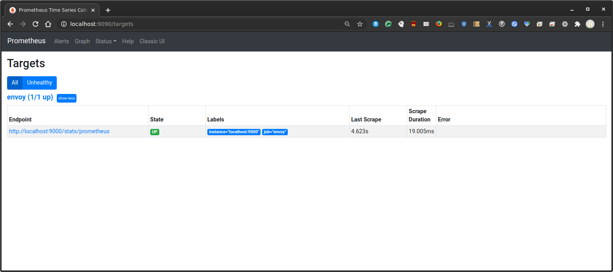
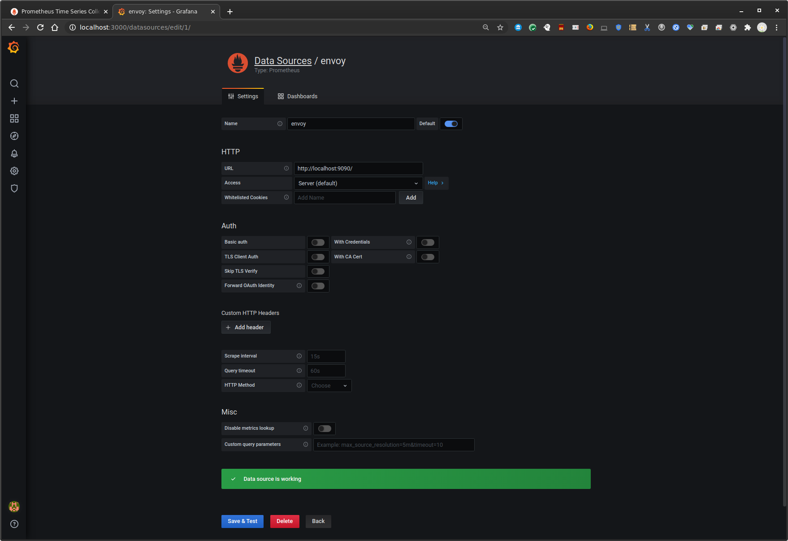
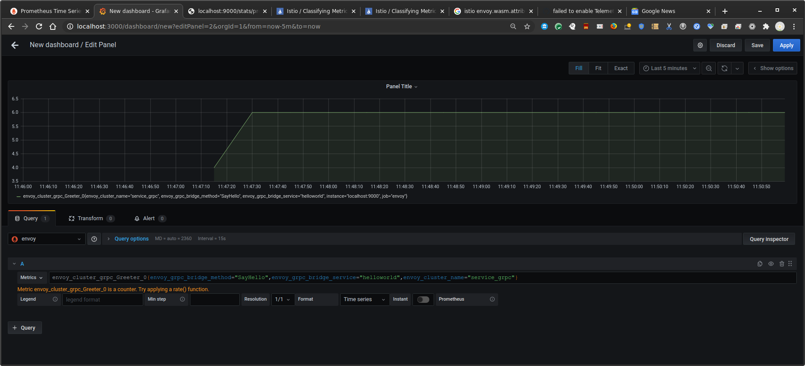
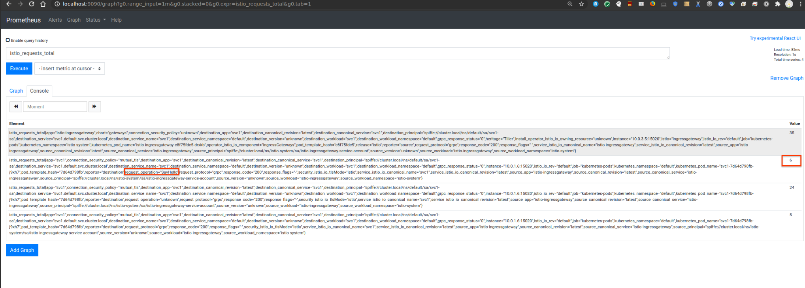
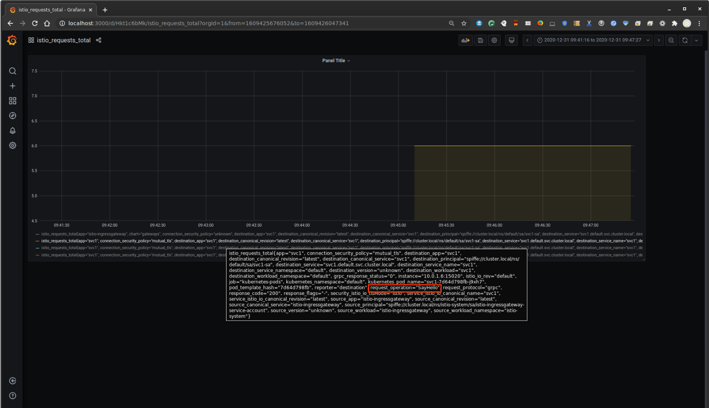
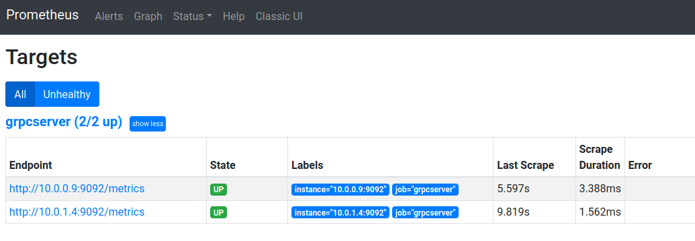
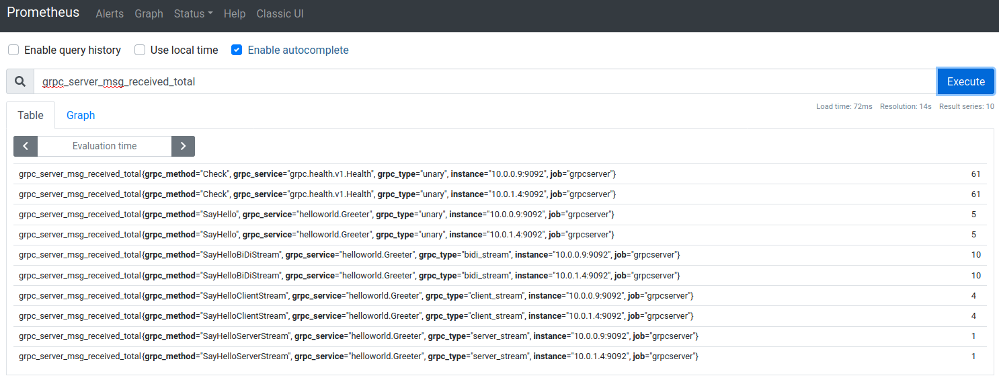

## gRPC per method observability with envoy, Istio, OpenCensus and GKE


This repo is a simple tutorial on how to setup envoy and istio such that _per method_ statistics are emitted to prometheus+grafana.

There are several techniques to emitting and collecting gRPC stats shown here:

* `client`-> `envoy` -> `server`:  Envoy will surface prometheus stats endpoint
* `client`-> `istio(envoy)` -> `server`:  Istio (envoy) will again surface a prometheus endpoint
* `client` (native prometheus gRPC):  Use gRPC built in prometheus stats endpoint `"github.com/grpc-ecosystem/go-grpc-prometheus"`
* `client` (opencensus prometheus): Use Opencensus's Prometheus exporter for gRPC `"contrib.go.opencensus.io/exporter/prometheus"`
* `client`-> `kubernetes ingress/service` -> `server`:  Deploy a GKE gRPC service and allow a prometheus server to scrape each gRPC server eposing `"github.com/grpc-ecosystem/go-grpc-prometheus"`

Both istio and envoy have robust metric monitoring capability but the default granularity for these are at the [service level](https://istio.io/latest/docs/concepts/observability/#service-level-metrics).  If you needed resolution at the method you would need to some further configuration settings if using envoy or istio:

- [Envoy gRPC Statistics filter](https://www.envoyproxy.io/docs/envoy/latest/configuration/http/http_filters/grpc_stats_filter) (`envoy.filters.http.grpc_stats`)
- [Istio wasm telemetry](https://istio.io/latest/docs/reference/config/proxy_extensions/wasm_telemetry/)


This repo walks you through a sample setup for both standalone envoy and istio where the count of a specific method call (`/helloworld.Greeter/SayHello`) is emitted and collected via prometheus and subsequently rendered in grafana.

You can either test this with envoy or istio but the mechanism is a bit different

## Envoy

With envoy, we will use the built in `envoy.filters.http.grpc_stats` filter.

### Start Envoy 1.17

First get envoy.  We are using a pretty recent version (as of end of 2020).

```bash
docker cp `docker create envoyproxy/envoy-dev:latest`:/usr/local/bin/envoy .
```

start envoy

```bash
cd envoy/
./envoy -c server.yaml
```

Notice we configured the filter to emit everything:

```yaml
          http_filters:
          - name: envoy.filters.http.grpc_stats
            typed_config:
              "@type": type.googleapis.com/envoy.extensions.filters.http.grpc_stats.v3.FilterConfig
              stats_for_all_methods: true
              enable_upstream_stats: true                            
          - name: envoy.filters.http.router
```

### Start GRPC Server

Now start the gRPC server

```bash
cd app/
go run greeter_server/main.go
```

The server will by default listen in on `:50051`


## Start Prometheus

Start a local instance of prometheus that interrogates envoy:

```bash
cd envoy/
docker run \
    --net=host \
    -p 9090:9090 \
    -v `pwd`/prometheus/prometheus.yml:/etc/prometheus/prometheus.yml \
    prom/prometheus
```

Ensure Prometheus Target (i.e, envoy) are up:  [http://localhost:9090/targets](http://localhost:9090/targets)



then verify envoy is emitting stats:


### Start Grafana

Start grafana 

```bash
docker run --net=host -p 3000:3000 grafana/grafana 
```

Configure grafana for a [prometheus datasource](https://prometheus.io/docs/visualization/grafana/#creating-a-prometheus-data-source)

```
 http://localhost:3000  admin/admin
 configuration=>datasources
   Select `Prometheus`
    Name: `envoy`
    URL: `http://localhost:9090/`
```




### Grpc Client

Run gRPC client. 

```bash
go run greeter_client/main.go  --host localhost:8080
```

The gRPC client will make several different types of API calls:

-  `rpc SayHello (HelloRequest) returns (HelloReply) {}`   Unary
-  `rpc SayHelloClientStream(stream HelloRequest) returns (HelloReply) {}` Client Stream
-  `rpc SayHelloServerStream(HelloRequest) returns (stream HelloReply) {}` Server Stream   
-  `rpc SayHelloBiDiStream(stream HelloRequest) returns (stream HelloReply) {}` Bidirectional Stream


(you can put this command in a loop,eg 6 times)

### Observe

Prometheus will begin collecting all the metrics from envoy at this point.  The specific one we are interested in is just `SayHello` API method call.

#### Envoy

You can view the prometheus endpoint directly on envoy and see the stats:
Envoy:  [http://localhost:9000/stats/prometheus](http://localhost:9000/stats/prometheus)

`envoy_cluster_grpc_Greeter_0{envoy_grpc_bridge_method="SayHello",envoy_grpc_bridge_service="helloworld",envoy_cluster_name="service_grpc"}`


#### Prometheus

Similarly, on the Prometheus dashboard, see the gRPC Statistics (eg, number `SayHello` invocations)

In our case, if you invoked the client 6 times, you'll see that count:

```log
# TYPE envoy_cluster_grpc_Greeter_0 counter
envoy_cluster_grpc_Greeter_0{envoy_grpc_bridge_method="SayHello",envoy_grpc_bridge_service="helloworld",envoy_cluster_name="service_grpc"} 6
envoy_cluster_grpc_Greeter_0{envoy_grpc_bridge_method="SayHelloBiDiStream",envoy_grpc_bridge_service="helloworld",envoy_cluster_name="service_grpc"} 6
envoy_cluster_grpc_Greeter_0{envoy_grpc_bridge_method="SayHelloClientStream",envoy_grpc_bridge_service="helloworld",envoy_cluster_name="service_grpc"} 6
envoy_cluster_grpc_Greeter_0{envoy_grpc_bridge_method="SayHelloServerStream",envoy_grpc_bridge_service="helloworld",envoy_cluster_name="service_grpc"} 6
```

#### Grafana

Finally, create a dashboard for the invocation counts

Use the same metric as above (i.,e invocation count)




### Istio

The istio configuration is a bit different.  It uses a specific wasm stats filter as described here

- [Classifying Metrics Based on Request or Response](https://istio.io/latest/docs/tasks/observability/metrics/classify-metrics/#classify-metrics-by-request)


#### Create GKE cluster and install istio 1.8

Create an istio cluster (we are using GKE)

```bash
cd istio/

gcloud container  clusters create cluster-1 --machine-type "n1-standard-2" --zone us-central1-a  --num-nodes 4 --enable-ip-alias \
  --cluster-version "1.19" -q

gcloud container clusters get-credentials cluster-1 --zone us-central1-a

kubectl create clusterrolebinding cluster-admin-binding --clusterrole=cluster-admin --user=$(gcloud config get-value core/account)

kubectl create ns istio-system

export ISTIO_VERSION=1.8.0

wget https://github.com/istio/istio/releases/download/$ISTIO_VERSION/istio-$ISTIO_VERSION-linux-amd64.tar.gz
tar xvf istio-$ISTIO_VERSION-linux-amd64.tar.gz
rm istio-$ISTIO_VERSION-linux-amd64.tar.gz

export PATH=`pwd`/istio-$ISTIO_VERSION/bin:$PATH

istioctl install --set profile=preview \
 --set meshConfig.enableAutoMtls=true  \
 --set values.gateways.istio-ingressgateway.runAsRoot=true 

kubectl apply -f https://raw.githubusercontent.com/istio/istio/release-1.8/samples/addons/prometheus.yaml
kubectl apply -f https://raw.githubusercontent.com/istio/istio/release-1.8/samples/addons/grafana.yaml

kubectl get no,po,rc,svc,ing,deployment -n istio-system 

kubectl label namespace default istio-injection=enabled
```

(wait a couple of mins)

- Open up several new shell windows and type in one line into each:

```bash
kubectl -n istio-system port-forward $(kubectl -n istio-system get pod -l app=grafana -o jsonpath='{.items[0].metadata.name}') 3000:3000

kubectl port-forward -n istio-system $(kubectl get pod -n istio-system -l app=prometheus -o jsonpath='{.items[0].metadata.name}') 9090:9090
```

Open up browser windows to each

Open up a browsers tabs and go to:

- `Grafana`: [http://localhost:3000/dashboard/db/istio-mesh-dashboard](http://localhost:3000/dashboard/db/istio-mesh-dashboard)
- `Prometheus`: [http://localhost:9090/targets](http://localhost:9090/targets)


- Find the gatewayIP

```bash
$ kubectl get svc istio-ingressgateway -n istio-system

export GATEWAY_IP=$(kubectl -n istio-system get service istio-ingressgateway -o jsonpath='{.status.loadBalancer.ingress[0].ip}')
echo $GATEWAY_IP
```

#### Deploy gRPC Server 

```bash
kubectl apply -f istio-deployment.yaml -f istio-svc1.yaml -f istio-ingress-gateway.yaml
```

(optional) If you want, enable wasm proxy debugging:

```bash
kubectl port-forward -n default deployment/svc1 15000
curl -XPOST "localhost:15000/logging?wasm=trace"
```

and look at the logs on the service itself

```bash
$ kubectl get po
NAME                    READY   STATUS    RESTARTS   AGE
svc1-7d64d798fb-j9xh7   2/2     Running   0          57s

$ kubectl logs svc1-7d64d798fb-j9xh7 -c istio-proxy
```


#### Test gRPC Client

Now test that the basic istio/grpc app is accessible before we enable stats:

```bash
cd app/

$ go run greeter_client/main.go --host $GATEWAY_IP:80
        2020/12/30 12:33:11 RPC HealthChekStatus:SERVING
        2020/12/30 12:33:11 Unary Request Response:  Hello world  --> 16f5314c-4ac5-11eb-8c55-760e4197937a 
        2020/12/30 12:33:12  Got SayHelloClientStream  [SayHelloClientStream  Response]
        2020/12/30 12:33:12 Message: [SayHelloServerStream Response]
        2020/12/30 12:33:12 Message: [SayHelloServerStream Response]
        2020/12/30 12:33:12 Message: [SayHelloServerStream Response]
        2020/12/30 12:33:12 Message: [SayHelloServerStream Response]
        2020/12/30 12:33:12 Message: [SayHelloServerStream Response]
        2020/12/30 12:33:12 Stream Trailer:  map[]
        2020/12/30 12:33:12 Response: [SayHelloBiDiStream Server Response] 
        2020/12/30 12:33:12 Response: [SayHelloBiDiStream Server Response] 
        2020/12/30 12:33:12 Response: [SayHelloBiDiStream Server Response] 
        2020/12/30 12:33:12 Response: [SayHelloBiDiStream Server Response] 
        2020/12/30 12:33:12 Response: [SayHelloBiDiStream Server Response] 
        2020/12/30 12:33:12 Response: [SayHelloBiDiStream Server Response] 
        2020/12/30 12:33:12 Response: [SayHelloBiDiStream Server Response] 
        2020/12/30 12:33:12 Response: [SayHelloBiDiStream Server Response] 
        2020/12/30 12:33:12 Response: [SayHelloBiDiStream Server Response] 
        2020/12/30 12:33:12 Response: [SayHelloBiDiStream Server Response]
```

#### Enable metrics

Now enable the stats.  The CEL rule below will emit a counter everytime the request method shown below is invoked.  We are using a standard envoy request [url attribute](https://www.envoyproxy.io/docs/envoy/latest/intro/arch_overview/advanced/attributes#arch-overview-request-attributes) in the rule below

```json
{
    "value": "SayHello",
    "condition": "request.path == '/helloworld.Greeter/SayHello' && request.method == 'POST'"
}
```


Apply the attribute rule:

```bash
kubectl -n istio-system apply -f attribute_gen_service.yaml
```

Now extract the stats filter

```
kubectl -n istio-system get envoyfilter stats-filter-1.8 -o yaml > stats-filter-1.8.yaml
```

Edit `stats-filter-1.8.yaml`

and define the rule shown below under the `context: SIDECAR_INBOUND` section.
(btw, the istio docs has incorrect indents shown...)

```yaml
  - applyTo: HTTP_FILTER
    match:
      context: SIDECAR_INBOUND
      listener:
        filterChain:
          filter:
            name: envoy.http_connection_manager
            subFilter:
              name: envoy.router
      proxy:
        proxyVersion: ^1\.8.*
    patch:
      operation: INSERT_BEFORE
      value:
        name: istio.stats
        typed_config:
          '@type': type.googleapis.com/udpa.type.v1.TypedStruct
          type_url: type.googleapis.com/envoy.extensions.filters.http.wasm.v3.Wasm
          value:
            config:
              configuration:
                '@type': type.googleapis.com/google.protobuf.StringValue
                value: |
                  {
                    "metrics": [
                      {
                        "name": "requests_total",
                        "dimensions": {
                          "request_operation": "istio_operationId"
                        }
                      }
                    ]
                  }
              root_id: stats_inbound
              vm_config:
                allow_precompiled: true
                code:
                  local:
                    filename: /etc/istio/extensions/stats-filter.compiled.wasm
                runtime: envoy.wasm.runtime.v8
                vm_id: stats_inbound

```

Apply

```bash
kubectl apply -n istio-system -f stats-filter-1.8.yaml
```

#### Send more grpc Requests

For examle 6 more requests

```bash
go run greeter_client/main.go --host $GATEWAY_IP:80
```

#### View Prometheus

You should now see the prometheus stats now under `istio_requests_total` that emits the label `request_operation` with value `SayHello` 
```log
istio_requests_total{app="svc1",connection_security_policy="mutual_tls",destination_app="svc1",destination_canonical_revision="latest",destination_canonical_service="svc1",destination_principal="spiffe://cluster.local/ns/default/sa/svc1-sa",destination_service="svc1.default.svc.cluster.local",destination_service_name="svc1",destination_service_namespace="default",destination_version="unknown",destination_workload="svc1",destination_workload_namespace="default",grpc_response_status="0",instance="10.0.1.6:15020",istio_io_rev="default",job="kubernetes-pods",kubernetes_namespace="default",kubernetes_pod_name="svc1-7d64d798fb-j9xh7",pod_template_hash="7d64d798fb",reporter="destination",request_operation="SayHello",request_protocol="grpc",response_code="200",response_flags="-",security_istio_io_tlsMode="istio",service_istio_io_canonical_name="svc1",service_istio_io_canonical_revision="latest",source_app="istio-ingressgateway",source_canonical_revision="latest",source_canonical_service="istio-ingressgateway",source_principal="spiffe://cluster.local/ns/istio-system/sa/istio-ingressgateway-service-account",source_version="unknown",source_workload="istio-ingressgateway",source_workload_namespace="istio-system"}
```

which you can see in prometheus console (note the count is 6 per the number of invocations)



#### View Grafana

The same stat on grafana too



---

## Metrics from gRPC Prometheus endpoint

You can also start a gRPC server which also serves as an endpoint surfacing prometheus metrics.  In this mode, the individual gRPC server starts up an http server which only serves to provide prometheus metrics.  This is described in the link here:

- [Go gRPC Interceptors for Prometheus monitoring](https://github.com/grpc-ecosystem/go-grpc-prometheus)

You can optionally enable this setting by uncommenting the lines in `greeter_server/main.go` 

```golang
import (
	grpc_prometheus "github.com/grpc-ecosystem/go-grpc-prometheus"
	"github.com/prometheus/client_golang/prometheus"
	"github.com/prometheus/client_golang/prometheus/promhttp"
)

var (
	// *********** Start gRPC built in
	reg                     = prometheus.NewRegistry()
	grpcMetrics             = grpc_prometheus.NewServerMetrics()
	customizedCounterMetric = prometheus.NewCounterVec(prometheus.CounterOpts{
		Name: "demo_server_say_hello_method_handle_count",
		Help: "Total number of RPCs handled on the server.",
	}, []string{"name"})
	// *********** End gRPC built in
)

func init() {
	// *********** Start gRPC built in
	reg.MustRegister(grpcMetrics, customizedCounterMetric)
	customizedCounterMetric.WithLabelValues("Test")
	// *********** End gRPC built in
}

func main() {
  ...
	// *********** Start Direct
	// Use gRPC-go internal prom exporter
	httpServer := &http.Server{Handler: promhttp.HandlerFor(reg, promhttp.HandlerOpts{}), Addr: fmt.Sprintf("0.0.0.0:%d", 9092)}
	sopts = append(sopts, grpc.StreamInterceptor(grpcMetrics.StreamServerInterceptor()), grpc.UnaryInterceptor(grpcMetrics.UnaryServerInterceptor()))

	s = grpc.NewServer(sopts...)
	grpcMetrics.InitializeMetrics(s)
	go func() {
		if err := httpServer.ListenAndServe(); err != nil {
			log.Fatal("Unable to start a http server.")
		}
	}()
	// *********** End Direct

```

and in `prometheus/prometheus.yml`:

```yaml
scrape_configs:
  - job_name: 'grpcserver'
    scrape_interval: 1s
    metrics_path: /metrics
    static_configs:
      - targets: ['localhost:9092']
```


The metrics would look like the following

```log
# HELP grpc_server_msg_received_total Total number of RPC stream messages received on the server.
# TYPE grpc_server_msg_received_total counter
grpc_server_msg_received_total{grpc_method="Check",grpc_service="grpc.health.v1.Health",grpc_type="unary"} 8
grpc_server_msg_received_total{grpc_method="SayHello",grpc_service="helloworld.Greeter",grpc_type="unary"} 4
grpc_server_msg_received_total{grpc_method="SayHelloBiDiStream",grpc_service="helloworld.Greeter",grpc_type="bidi_stream"} 40
grpc_server_msg_received_total{grpc_method="SayHelloClientStream",grpc_service="helloworld.Greeter",grpc_type="client_stream"} 16
grpc_server_msg_received_total{grpc_method="SayHelloServerStream",grpc_service="helloworld.Greeter",grpc_type="server_stream"} 4
grpc_server_msg_received_total{grpc_method="Watch",grpc_service="grpc.health.v1.Health",grpc_type="server_stream"} 0
```
---

## Metrics using OpenCensus

Also included in this repo is sample code in how to emit gRPC stats using [OpenCensus](https://opencensus.io/).  Specifically, we will enable default gRPC stats and use OpenCensus's Prometheus Exporter.

To use this 

You can optionally enable this setting by uncommenting the lines in `greeter_server/main.go` 

```golang
import (
	// *********** Start OpenCensus
	"contrib.go.opencensus.io/exporter/prometheus"
	"go.opencensus.io/plugin/ocgrpc"
	"go.opencensus.io/stats/view"
	// *********** End Opencensus
)

func main() {
  ...
	// *********** Start OpenCensus
	pe, err := prometheus.NewExporter(prometheus.Options{
		Namespace: "oc",
	})
	if err != nil {
		log.Fatalf("Failed to create Prometheus exporter: %v", err)
	}

	go func() {
		mux := http.NewServeMux()
		mux.Handle("/metrics", pe)
		if err := http.ListenAndServe(":9092", mux); err != nil {
			log.Fatalf("Failed to run Prometheus /metrics endpoint: %v", err)
		}
	}()

	if err := view.Register(ocgrpc.DefaultServerViews...); err != nil {
		log.Fatal(err)
	}
	sopts = append(sopts, grpc.StatsHandler(&ocgrpc.ServerHandler{}))
	s = grpc.NewServer(sopts...)
	// *********** End Opencensus
```

and in `prometheus/prometheus.yml`:

```yaml
scrape_configs:
  - job_name: 'grpcserver'
    scrape_interval: 1s
    metrics_path: /metrics
    static_configs:
      - targets: ['localhost:9092']
```

Then run the server and client.  The promethus stats should show up as the following:

```log
# HELP oc_grpc_io_server_completed_rpcs Count of RPCs by method and status.
# TYPE oc_grpc_io_server_completed_rpcs counter
oc_grpc_io_server_completed_rpcs{grpc_server_method="grpc.health.v1.Health/Check",grpc_server_status="OK"} 6
oc_grpc_io_server_completed_rpcs{grpc_server_method="helloworld.Greeter/SayHello",grpc_server_status="OK"} 6
oc_grpc_io_server_completed_rpcs{grpc_server_method="helloworld.Greeter/SayHelloBiDiStream",grpc_server_status="OK"} 6
oc_grpc_io_server_completed_rpcs{grpc_server_method="helloworld.Greeter/SayHelloClientStream",grpc_server_status="OK"} 6
oc_grpc_io_server_completed_rpcs{grpc_server_method="helloworld.Greeter/SayHelloServerStream",grpc_server_status="OK"} 6
```

This repo is just a tutorial on fine-grain observability with istio and envoy


## Metrics using GKE

In this variation, we will create a GKE cluster into which we will deploy a gRPC server that exposes the prometheus scraping endpoint at `/metrics`.

A GKE prometheus server will use [kubernetes_sd_configs](https://prometheus.io/docs/prometheus/latest/configuration/configuration/#kubernetes_sd_config) to discover each gRPC service (deployed with `ClusterIP`) as targets to accumulate metrics from each service

The sample GKE gRPC ingress code is taken from [KE gRPC Ingress LoadBalancing](https://github.com/salrashid123/gcegrpc/tree/master/gke_ingress_lb)

```bash
cd gke/

gcloud container  clusters create cluster-1 --machine-type "n1-standard-2" \
  --zone us-central1-a  \
  --num-nodes 2 --enable-ip-alias  \
  --cluster-version "1.19" \
  --scopes "https://www.googleapis.com/auth/cloud-platform" \
  --enable-stackdriver-kubernetes

kubectl apply \
 -f fe-configmap.yaml \
 -f fe-deployment.yaml \
 -f fe-hc-secret.yaml \
 -f fe-ingress.yaml \
 -f fe-secret.yaml \
 -f fe-server-secret.yaml \
 -f fe-srv-ingress.yaml \
 -f fe-srv-lb.yaml

# get the endpoints (wait about 10mins)
$ kubectl get po,svc,ing,cm
NAME                                READY   STATUS    RESTARTS   AGE
pod/fe-deployment-8f874fb6b-6xdgc   2/2     Running   0          94s
pod/fe-deployment-8f874fb6b-8xztq   2/2     Running   0          94s

NAME                      TYPE           CLUSTER-IP   EXTERNAL-IP     PORT(S)           AGE
service/fe-srv-ingress    ClusterIP      10.4.9.115   <none>          50051/TCP         93s
service/fe-srv-lb         LoadBalancer   10.4.6.171   35.225.171.36   50051:31916/TCP   93s
service/kubernetes        ClusterIP      10.4.0.1     <none>          443/TCP           3m48s
service/rpc-app-service   ClusterIP      10.4.8.12    <none>          9092/TCP          93s

NAME                                   CLASS    HOSTS   ADDRESS         PORTS     AGE
ingress.networking.k8s.io/fe-ingress   <none>   *       34.120.140.72   80, 443   94s

NAME                         DATA   AGE
configmap/kube-root-ca.crt   1      3m33s
configmap/settings           2      95s

# Test gRPC client server

cd app/
$ gcloud compute firewall-rules create allow-grpc-nlb --action=ALLOW --rules=tcp:50051 --source-ranges=0.0.0.0/0
$ go run greeter_client/main.go --host 35.225.171.36:50051 --usetls  --cacert certs/CA_crt.pem --servername server.domain.com

$ go run greeter_client/main.go --host 34.120.140.72:443 --usetls  --cacert certs/CA_crt.pem --servername server.domain.com

# now deploy prometheus 

kubectl apply -f prom-deployment.yaml
```

View the prometheus service endpoint

```bash
kubectl  port-forward service/prometheus-service  9090
```

Open a browser and goto: `http://localhost:9090/targets`

You should see the two gRPC application pods as targets (which means prometheus is scraping from each gRPC server)



as well as the stats:

